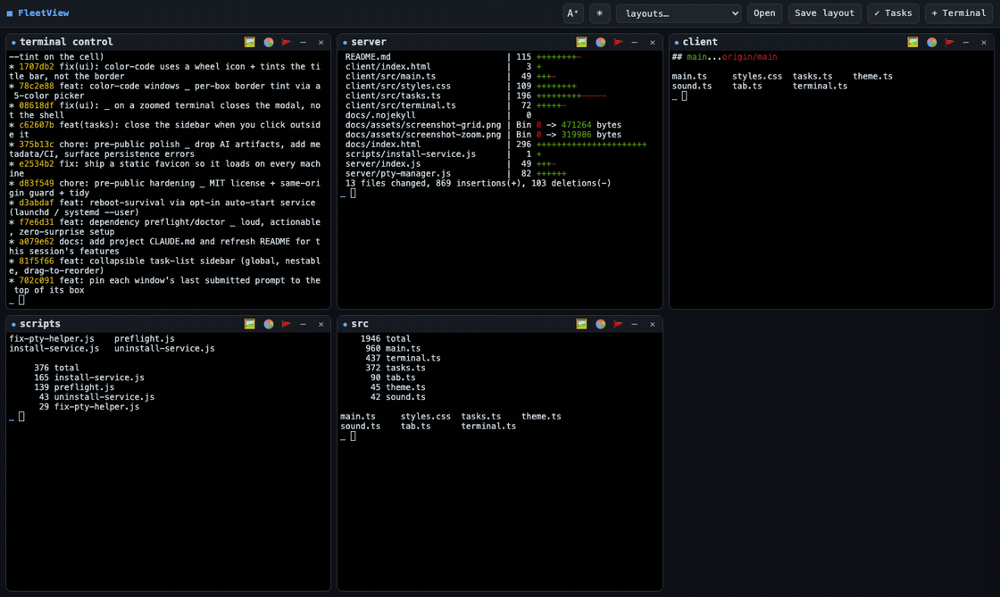
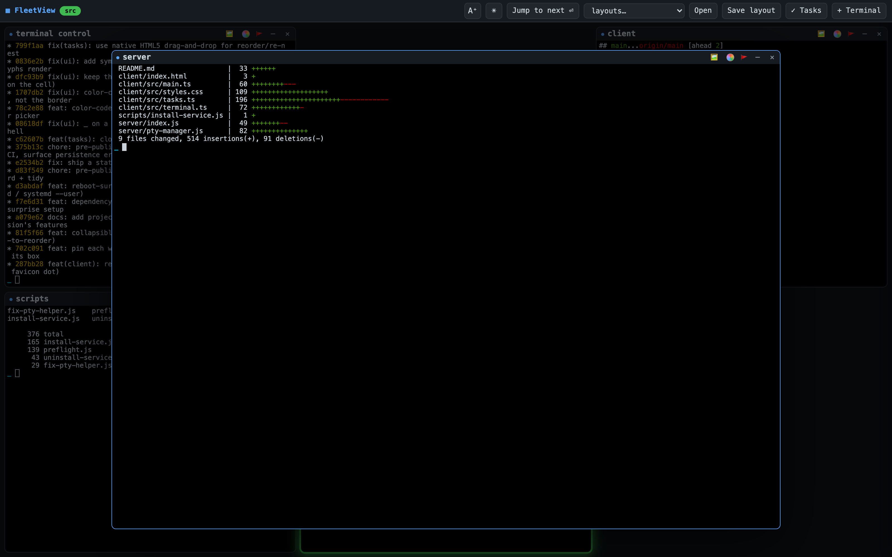

<div align="center">

# ▦ FleetView — Terminal Control

### One browser window. A grid of real terminals. A Claude in every box.

When a Claude **needs your approval or finishes**, its box **glows**, **dings**, and a
chip jumps to the top bar — so you can run a fleet of agents at once and never miss
the one that's waiting on you.

[](https://github.com/schoppllc/Terminalcontrol/actions/workflows/ci.yml)
[](LICENSE)




<em>A box <strong>needs you</strong> → a chip jumps to the top bar → click to fly it to center → another finishes <strong>done</strong>. (<a href="docs/assets/screenshot-grid.png">still shot</a>)</em>

</div>

---

FleetView is a **local tool**. A tiny Node server on `localhost` spawns real shells on
your machine (macOS or Linux, via `node-pty`) and a single-page app renders them as a
grid of [xterm.js](https://xtermjs.org/) boxes. Point each one at a folder, run `claude`
in it, and drive a whole fleet from one window. It binds to `127.0.0.1` only — it is
**not** for the cloud or a shared network. See [Security](#security).

## Why FleetView

- 🖥️ **A grid of real shells** — one `node-pty` terminal per box, the actual `claude`
  (or any shell), not a wrapper or a fake. Click a box and it **flies to the center**
  over a dimmed backdrop; click away or press `Esc` and it flies home.
- 🔔 **Attention without output-scraping** — each shell carries a unique
  `FLEET_PANE_ID`, and Claude Code **hooks** tell FleetView *exactly* which box needs
  you. Nothing is parsed from terminal text; the hooks are a **no-op** in any shell
  that isn't a FleetView terminal. Glow + ding + browser-tab badge.
- 💾 **Sleep-safe & restart-proof** — every box runs inside a detached `tmux` session,
  so your Claudes **survive a server restart or crash** and **auto-reconnect** after
  the laptop sleeps. No lost context, no manual refresh.
- ↩️ **Never silently lose a session** — if a session dies or you set it aside, the box
  isn't dropped: it lands in a **recovery bar**, reattachable with full state.
- 🗂️ **Layouts** — save and restore whole sets of terminals (folders + order); reorder
  by dragging; open a layout to **add** to the window or **replace** (non-destructively).
- ✅ **Shared task list** — a nestable, drag-to-reorder checklist synced live across
  every window.
- 🎨 **Make it yours** — light/dark, large-text mode, and per-box border **color-coding**,
  all persisted.
- 🔒 **Local-only by default** — loopback bind, a same-origin / anti-DNS-rebind guard,
  and honest docs for the one safe way to reach it remotely (a private tailnet).

<div align="center">

<br><em>Click any box to zoom it to center; the rest of the fleet dims behind it.</em>
</div>

## Quick start

```bash
npm install      # builds node-pty (native) and pulls xterm/vite
npm run doctor   # checks tmux / curl / claude; offers to install tmux
npm run go       # build the client, then start the server
```

Open **http://localhost:4280**. Click **+ Terminal**, pick a folder, and a shell opens
there running `claude` (untick "run claude" for a plain shell).

> 🌐 A visual tour lives at **[schoppllc.github.io/Terminalcontrol](https://schoppllc.github.io/Terminalcontrol/)**.

### Dependencies

Needs **Node.js** (macOS or Linux). Three external tools matter:

| Tool | Needed for | If missing |
|------|-----------|------------|
| **tmux** | **durability** — terminals surviving a server restart / sleep | the headline "sleep-safe / survives restart" feature **won't work**; treat tmux as **required** |
| **curl** | the attention hooks (glow / ding) | no alerts; usually preinstalled |
| **`claude`** | running `claude` in a box | plain shells still work |

`npm run doctor` reports exactly what's missing with the install command for your
platform, and can install tmux for you (interactive, or set `FLEET_AUTO_INSTALL=1`).
`npm run go` / `npm start` also run this check on boot and **warn loudly** if a
dependency is missing — a missing dependency is never silently ignored.

- **Restart without rebuilding:** `npm start` (serves the existing `dist/`).
  `npm run go` rebuilds the client every time — use it after client changes or a
  fresh `npm install`; use `npm start` for a plain restart (e.g. after installing tmux).
- **Different port:** `FLEET_PORT=5000 npm run go`.

## Security

FleetView spawns **real shells with no authentication**: anything that can reach
its port can run arbitrary commands on the host. To contain that, the server
**binds to `127.0.0.1` (loopback) by default**, so only programs on this machine
can connect.

Do not expose it to a network. If you knowingly need LAN access (trusted,
firewalled network only), opt in explicitly:

```bash
FLEET_HOST=0.0.0.0 npm run go   # reachable from the network — you accept the risk
```

It prints a warning when bound to anything other than loopback. There is still no
auth, so put it behind a VPN/SSH tunnel/reverse proxy if you go this route.

Also enforced for any browser request: a **same-origin / anti-DNS-rebind guard**.
A request carrying an `Origin` must have it match the `Host`, and (in loopback mode
or when an allowlist is set) the `Host` must be a trusted authority — so a website
you visit can't drive `localhost:4280` (cross-site `fetch`/WebSocket → your shells).
The local `curl` hooks send no `Origin` and are allowed.

## Remote access (securely)

Because there's no app auth, **never expose FleetView with a public URL** (no
`tailscale funnel`, ngrok-to-public, or open port). Reach it over a private,
authenticated network instead. Recommended: **Tailscale** (WireGuard mesh).

1. Install Tailscale on the host **and** each device you'll connect from; sign in;
   **enable 2FA** on the Tailscale account (an authenticator app is fine).
2. Keep FleetView on the default **loopback** bind.
3. Front it with a tailnet-only proxy (HTTPS, never public):
   ```bash
   tailscale serve --bg 4280
   ```
4. Tell FleetView's guard to trust your tailnet name, and bake it into the
   login service so it survives reboots:
   ```bash
   FLEET_ALLOWED_HOSTS=<machine>.<tailnet>.ts.net npm run service:install
   ```
   (find the name with `tailscale status` / the admin console). Without this, the
   guard rejects proxied requests with a 403.
5. Harden the tailnet in the admin console: turn on **device approval**, and add an
   **ACL** allowing only your devices to reach this host on `:4280`.

Then browse to `https://<machine>.<tailnet>.ts.net` from any approved device,
anywhere. Nothing is ever exposed to the public internet; access requires a
signed-in, approved device on your tailnet.

## Interactions

- **Open a terminal** — `+ Terminal` opens an in-browser folder browser: drill in
  with breadcrumbs, **search** the current folder, **sort** by name / last edited /
  last created, **create a folder** (`+ Folder`), one-click **recent folders**, and
  **★ Start** to pin the folder the picker opens to by default. Then it spawns the
  shell. Sort choice and default folder persist in `layouts.json`.
- **Zoom** — click a box to fly it to center over a dimmed scrim; click the scrim
  or press `Esc` to send it home.
- **Minimize** — the `–` control shrinks a box to a chip in the bottom tray (its
  Claude keeps running); click the chip to restore. The grid reflows to fill.
- **Close** — the `✕` control kills that shell.
- **Drag to rearrange** — grab a box by its title bar and drop it onto another
  slot to reorder the grid.
- **See what's running** — a box that's actually working gets a light travelling
  around its border and Matrix rain falling behind its output, while idle boxes dim
  and desaturate, so a glance at the grid tells you which agents are going. A box
  that **needs you** is never shown as busy — that amber glow always wins. `◍`
  cycles the effect: full → border light only → off.
- **Snapshots** — `npm run snapshot` writes what every box is doing (terminal
  scrollback, each agent's last exchange, the resume id) to
  `~/.fleetview/snapshots/` as JSON + Markdown; the server also writes one
  automatically when it's shut down. Agent chats additionally rebuild their own
  log from the SDK transcript on reconnect, so a restart no longer leaves you
  staring at a dozen empty boxes.
- **Appearance** — `☀/☾` toggles light/dark, `A⁺/A−` toggles large text. Both
  persist (localStorage) and apply to the terminals and UI live.
- **Layouts** — `Save layout` records this window's terminals (folders + order);
  `Open` respawns a layout and asks whether to **add** it to the current window or
  **replace** what's open. Stored in `layouts.json`. When a layout is the window's
  current one (shown as `▣ name` in the bar), **dragging to reorder auto-saves**
  the new order back to it. **Replace** is non-destructive — it sets the current
  terminals aside (recoverable), it doesn't kill them.
- **Recover** — if a terminal's session dies (e.g. a long system sleep tears down
  tmux) or you Replace a layout, the box isn't lost: it appears in the **⏎ recover**
  strip in the top bar; click to bring it back (reattached with full state if its
  session is still alive, otherwise a fresh shell in the same folder).
- **Pinned prompt** — the last prompt you sent a window's Claude is pinned under its
  title bar (`❯ …`, full text on hover) so you can see what you asked each one.
- **Tab badge** — when a box needs you, the browser tab title and favicon show it,
  so you notice from another tab.
- **Tasks** — `✓ Tasks` opens a collapsible right sidebar (closed by default): a
  single shared, nestable checklist. Add tasks/subtasks, check them off, edit
  inline, and **drag to reorder or re-nest**. Stored server-side in `tasks.json`
  and synced live across all your windows.
- **Sleep-safe** — close the laptop and reopen: terminals auto-reconnect; no manual
  refresh needed.

## Windows & sessions

**One workspace per machine.** Every window looking at the same FleetView sees the
same fleet — your laptop browser, a second window next to it, and the app on your
phone are all views of one set of terminals. Open a terminal on the laptop and it
appears on the phone; the attention queue, dings and layouts match everywhere.
Separate workspaces come from running FleetView on separate machines, which is
already how a tailnet is laid out.

This changed. Windows used to each be an independent workspace (a "session" in
`sessionStorage`), so a new window started empty. That model couldn't survive a
phone: an installed home-screen web app cold-launches with no session and a
manifest `start_url` with nowhere to put one, so it always opened an empty grid
instead of the fleet you actually run — and sharing by hand-copying a `?session=`
URL is not a substitute for the app icon just working.

A session id is still generated per window and still appears in the URL, but it no
longer decides what you see. It survives because ephemeral pane secrets are
released against the window that authorised them (see "Ephemeral secrets").

## How the alerting works (no output scraping)

Each terminal is spawned with a unique `FLEET_PANE_ID` in its environment. On every
server start, FleetView merges three **Claude Code hooks** into `~/.claude/settings.json`:

- **Notification** → POSTs `{pane, kind:"question"}` to the server (Claude needs you)
- **Stop** → POSTs `{pane, kind:"done"}` (Claude finished its turn)
- **UserPromptSubmit** → forwards your submitted prompt (it's pinned to that box)

So Claude tells FleetView *exactly* which box needs attention — nothing is parsed
from the terminal text. The hook commands are guarded with
`[ -n "$FLEET_PANE_ID" ]`, meaning they're a **no-op in any shell that isn't a
FleetView terminal**.

### Phone notifications (install it to your Home Screen)

The glow, the ding and the browser-tab indicator all need FleetView to be *open*
somewhere. To be told a terminal needs you while the app is closed — on a phone
in your pocket — install FleetView as a web app and turn on push:

1. Reach FleetView over **HTTPS**. Web Push and service workers require a secure
   context, so this means the `tailscale serve` setup in
   [TAILSCALE.md](TAILSCALE.md) (`http://localhost` also counts, for desktop
   testing). A plain `http://` LAN address will not work.
2. On iPhone/iPad: Safari → Share → **Add to Home Screen**, then open it from
   there. This step is not cosmetic — **iOS gives the Push API only to
   home-screen web apps**, never to a Safari tab. Android/desktop Chrome can
   subscribe from an ordinary tab.
3. Settings (⚙) → Alerts → **"Push to this device even when FleetView is
   closed"**. That checkbox is the per-device switch; the two options under it
   choose *what* gets pushed — a terminal needing an answer (on by default), and
   a turn finishing or being cut off (off by default, since it's noisy on a busy
   fleet). Those two are ordinary settings, so they follow you across devices;
   the device switch does not.

Tapping a notification opens the app with that terminal zoomed. The home-screen
icon carries a badge with the number of terminals waiting on you.

**What's in a notification:** the terminal's name and what happened — *"didit-web
needs you"*. Never the folder path, the command, the prompt, or any output. The
payload is also end-to-end encrypted (RFC 8291) with keys your browser generated,
so Apple's or Google's push service relays ciphertext it cannot read.

**Configuration.** Nothing is required. Two knobs exist if you want them:

| Var | Default | Notes |
|---|---|---|
| `FLEET_PUSH_CONTACT` | this repo's URL | The VAPID `sub` — who a push service contacts about this app server. Must be a `mailto:` or `https:` URL; Apple rejects anything else with `403 BadJwtToken`. |

The identity keypair is generated once at `~/.fleetview/vapid.json` (0600), and
subscriptions live beside it in `~/.fleetview/push-subscriptions.json`. ⚠ Deleting
`vapid.json` invalidates **every** device's subscription — each one only recovers
when you open FleetView on it again and re-subscribe.

### Removing the hooks

Open `~/.claude/settings.json` and delete the hook entries whose `command`
contains `FLEET_PANE_ID` (under `hooks.Notification`, `hooks.Stop`, and
`hooks.UserPromptSubmit`).

## What persists

- **Browser refresh / reopen** while the server is up → reconnects to the *same*
  live shells (your Claude sessions keep running, screen repainted from scrollback).
- **Server restart / crash** (machine stays powered on) → if **tmux** is installed,
  each shell runs inside a `fleet_<id>` tmux session that outlives the server, and
  FleetView **reattaches** on the next start (pane metadata is kept in
  `sessions.json`). The inner tmux is made transparent — no status bar, no prefix
  key, low escape-time — so Claude's TUI behaves normally. Without tmux, shells are
  tied to the server process and a restart loses them.
- **Reboot** → the tmux server dies too, so live sessions do **not** survive.
  Boxes come back as **fresh shells in the same folders** (not restored Claude
  sessions). The *server* can auto-return on login — see
  [Surviving a reboot](#surviving-a-reboot).
- **Dead/set-aside terminals** aren't dropped — their metadata is kept so you can
  recover them (see the **⏎ recover** strip).
- **Layouts** are stored in `layouts.json`; window order + per-pane last-prompt in
  `sessions.json`; the task list in `tasks.json`.

> tmux is **required** for durable terminals. Run `npm run doctor` (or just start
> the server — it checks on boot) and it'll tell you loudly if tmux is missing,
> with the exact install command, e.g. `brew install tmux` (then restart FleetView).

## Surviving a reboot

By default the server doesn't come back after a reboot — you'd run `npm start`
again. To have it start automatically on login:

```bash
npm run service:install     # launchd (macOS) or systemd --user (Linux)
npm run service:uninstall   # stop auto-starting
```

`service:install` captures a working `PATH` into the service environment (otherwise
launchd/systemd hand it a minimal PATH and it can't find tmux/claude/curl). Pass
`FLEET_PORT` / `FLEET_HOST` at install time to bake them in; on macOS logs go to
`~/Library/Logs/fleetview.log`. On Linux, to keep it running after you log out:
`loginctl enable-linger $USER`.

**Honest scope — what "survives a reboot" means:**

- ✅ The **server** auto-restarts and `localhost:4280` comes back up.
- ❌ Your **terminals do not** — a reboot kills the tmux server, so the restored
  boxes are **fresh shells in the same folders**, not your live Claude sessions.
  (tmux only preserves sessions across a *server* restart while the machine stays
  powered on.)

> Don't run the service **and** `npm start`/`npm run go` by hand at the same time —
> two servers will fight for the port (the second now exits with a readable error).
> Use `npm run service:uninstall` to stop the auto-start one.

## Architecture

```
Browser (per window)                 Node server (localhost:4280)
  grid of xterm.js boxes  ──WS /term──►  PtyManager  → one node-pty shell per box
  FLIP zoom-to-center                    LayoutStore → layouts.json
  attention queue/glow/sounds ◄─WS /control─ grid events (created/closed/attention)
                                       POST /hook  ◄── Claude Code hooks
```

| File | Responsibility |
|------|----------------|
| `server/pty-manager.js` | spawn/kill shells, tmux sessions, scrollback, attention, dormant recovery, persistence |
| `server/layout-store.js` | read/write named layouts + recent folders |
| `server/task-store.js` | read/write the global task tree (`tasks.json`) |
| `server/fs-browse.js` | list sub-directories for the folder picker |
| `server/setup-hooks.js` | idempotently install the guarded Claude Code hooks |
| `server/index.js` | HTTP + WebSocket wiring, REST + hook endpoints, static client |
| `client/src/terminal.ts` | one xterm box bound to one PTY socket (auto-reconnects) |
| `client/src/main.ts` | grid, zoom, minimize/tray, drag-reorder, folder picker, queue |
| `client/src/tasks.ts` | the task-list sidebar (tree, drag, debounced save) |
| `client/src/tab.ts` | browser-tab title + favicon attention indicator |
| `client/src/sound.ts` | generated alert tones (WebAudio) |

## Contributing

Issues and PRs welcome. Before opening a PR: `npm run typecheck` and `npm run build`
should pass (CI runs typecheck + build + `node --check`). There's no test framework —
verify changes with throwaway Node scripts against isolated temp state (never boot a
real server for a test; it reads/writes live `sessions.json` / `layouts.json` /
`tasks.json` and reattaches real tmux sessions).

## License

MIT — see [LICENSE](LICENSE).
